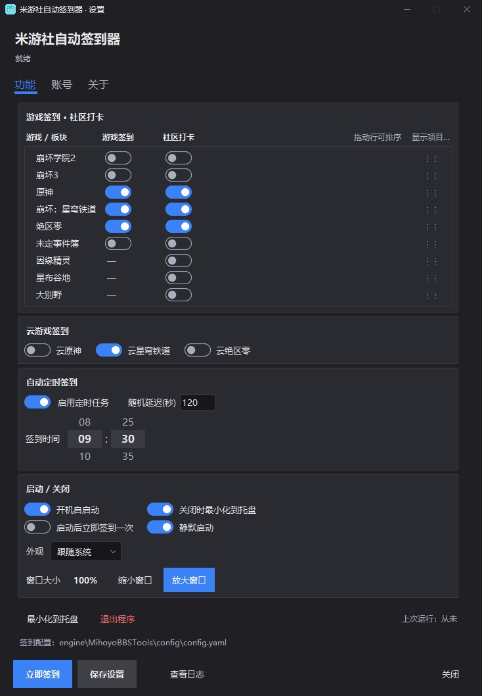
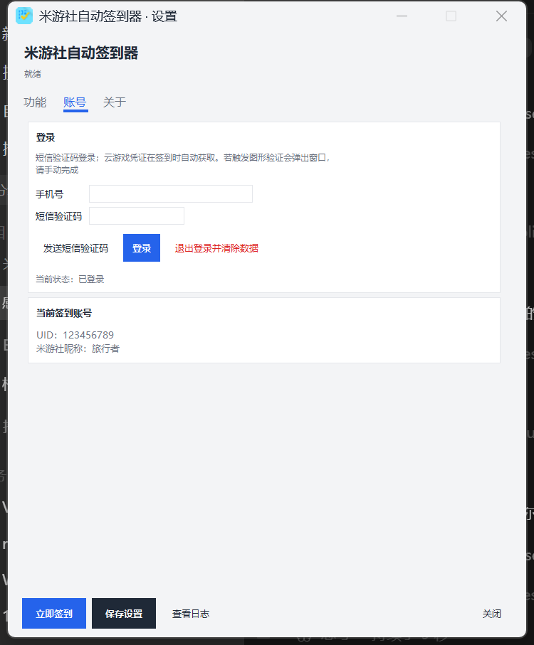
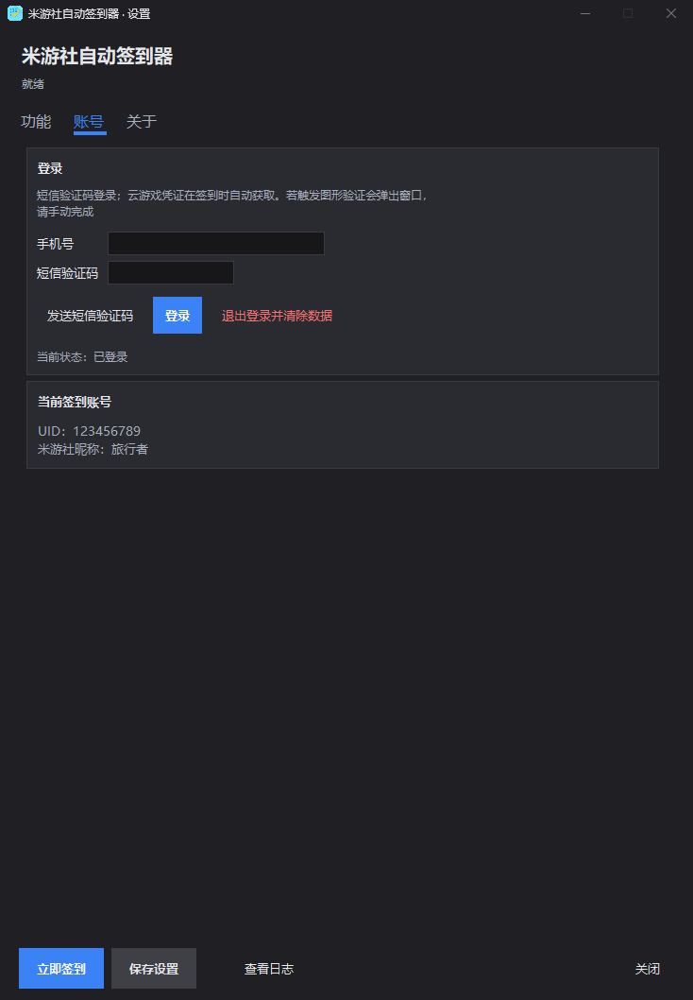

# 米游社自动签到器 · MihoyoBBSAutoSigner

<p align="center">
  
</p>

<p align="center">
  <b>Windows 托盘工具</b> · 米游社 / 米哈游游戏辅助自动签到
</p>

<p align="center">
  
</p>

> **个人学习与自用。请遵守米哈游用户协议与当地法律。非官方项目。**

## 界面

<p align="center">
  <a href="docs/assets/ui-settings.png"></a>
  <a href="docs/assets/ui-settings-dark.png"></a>
</p>

<p align="center">
  <a href="docs/assets/ui-account.png"></a>
  <a href="docs/assets/ui-account-dark.png"></a>
</p>

（点图可看原尺寸）

## 功能

- 托盘常驻；双击打开设置；可配置关闭时最小化到托盘
- 设置界面为卡片式三页（功能 / 账号 / 关于），可切换浅色、深色或跟随系统
- 游戏与板块清单可拖动排序，用不到的板块可在「显示项目…」里隐藏
- 游戏签到：原神、崩坏：星穹铁道、绝区零、崩坏3、崩坏学院2、未定事件簿
- 社区打卡（米游币规则见下）
- 云游戏签到：云原神、云星穹铁道、云绝区零（凭证在签到时自动获取，无需手动抓包）
- 定时签到：滚轮选时 / 分并支持随机延迟；到点后当天还没签成功会自动补签，当天已签成功不重复执行，失败自动重试
- 开机自启动；静默启动（勾选后启动不弹窗，再双击一次程序即可打开窗口）；启动后立即签到一次
- 短信验证码登录；账号区显示 UID 与米游社昵称
- 窗口大小可逐档缩放（70%~200%），缩放时窗口不重建、不闪屏
- 首次运行自动生成配置文件，无需手动复制

## 米游币说明（2026-09 现状）

- 米游币现在**只有社区打卡**发放：首日 30 枚，连续签到满三天 40 枚、满五天 50 枚
- 点赞（2025-12）、分享（2026-03）、看帖（2026-03）的米游币奖励均已下线，因此本工具已移除点赞与分享
- 拿满当日米游币只需完成社区打卡

## 下载

请到 [Releases](https://github.com/nekwken/MihoyoBBSAutoSigner/releases) 下载完整包（含编译好的 exe、引擎与内置运行环境）。

解压后运行：

```text
MihoyoBBSAutoSigner/
├── MihoyoBBSAutoSigner.exe    # 托盘程序
├── engine/MihoyoBBSTools/     # 签到引擎
├── runtime/                   # 内置 Python 运行时（免安装）
├── README.md
├── SECURITY.md
├── LICENSE
└── 使用说明.txt
```

首次使用：

1. 运行 `MihoyoBBSAutoSigner.exe`（首次会自动生成 `engine/MihoyoBBSTools/config/config.yaml`）
2. 托盘图标 → 设置 → 「账号」页短信登录
3. 「功能」页勾选游戏签到 / 社区打卡 / 云游戏签到 → 保存 → 立即签到或等待定时

## 从源码运行

```powershell
cd TrayApp
pip install -r requirements.txt
pip install -r ../engine/MihoyoBBSTools/requirements.txt
python main.py
```

打包：

```powershell
cd TrayApp
.\build.ps1
```

## 目录结构

```text
MihoyoBBSAutoSigner/
├── TrayApp/                 # 托盘 UI 与调度
├── engine/MihoyoBBSTools/   # 签到引擎（本地维护版）
├── docs/assets/             # README 截图与图标
├── README.md
├── SECURITY.md
└── LICENSE
```

签到逻辑由 `engine/MihoyoBBSTools/main.py` 在子进程中执行；账号信息写入引擎的 `config/config.yaml`。

## 引擎说明

`engine/MihoyoBBSTools` 基于开源项目 [Womsxd/MihoyoBBSTools](https://github.com/Womsxd/MihoyoBBSTools)（MIT）并包含本项目为适配当前客户端所做的本地修改（版本号、接口路径、请求头与结果输出等）。**不向原仓库提交 PR。**

## 免责声明

1. 仅限用户**自有账号**
2. **不自动化**图形验证码 / 风控
3. 不鼓励多开、刷号、商业滥用
4. 接口变更导致失效属预期
5. **非米哈游官方项目**；使用风险自负

## 致谢

- [Womsxd/MihoyoBBSTools](https://github.com/Womsxd/MihoyoBBSTools) — 开源签到引擎（MIT）

## License

MIT，见 [LICENSE](LICENSE)。
