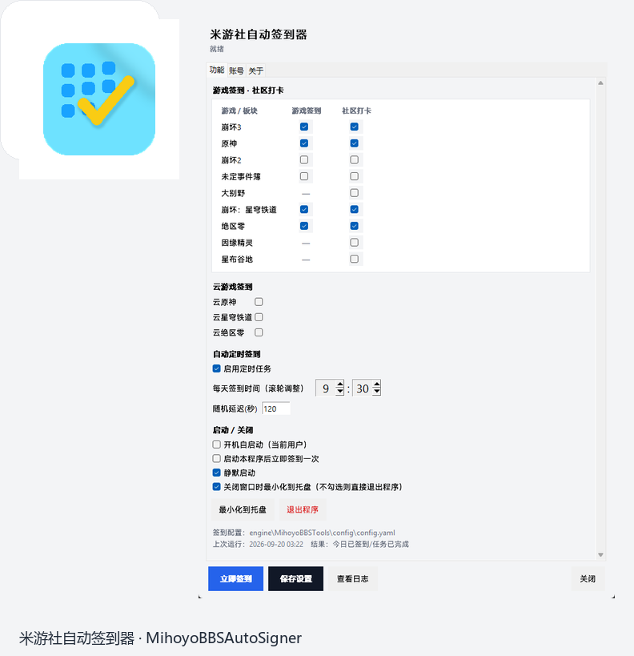
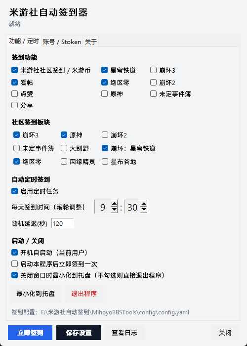

# 米游社自动签到器 · MihoyoBBSAutoSigner

<p align="center">
  
</p>

<p align="center">
  <b>Windows 托盘工具</b> · 米游社 / 米哈游游戏辅助自动签到
</p>

<p align="center">
  
</p>

<p align="center">
  
</p>

> **个人学习与自用。请遵守米哈游用户协议与当地法律。。非官方项目。**

## 功能

- 托盘常驻；双击打开设置；可配置关闭时最小化到托盘
- 社区打卡 / 米游币（看帖、点赞、分享可选）
- 游戏签到：原神、星穹铁道、绝区零、崩坏2/3、未定等
- 社区板块勾选；滚轮调整每日签到时间
- 短信验证码登录一站式自动获取 Stoken

## 下载

请到 [Releases](https://github.com/nekwken/MihoyoBBSAutoSigner/releases) 下载完整包（含编译好的 exe 与引擎）。

解压后运行：

```text
MihoyoBBSAutoSigner/
├── MihoyoBBSAutoSigner.exe    # 托盘程序
├── engine/MihoyoBBSTools/     # 签到引擎
├── README.md
└── LICENSE
```

首次使用：

1. 将 `engine/MihoyoBBSTools/config/config.yaml.example` 复制为同目录 `config.yaml`
2. 运行 `MihoyoBBSAutoSigner.exe`
3. 设置 →「账号 / Stoken」短信登录
4. 勾选功能与板块 → 保存 → 立即签到 / 等待定时

## 从源码运行

```powershell
cd TrayApp
pip install -r requirements.txt
pip install -r ../engine/MihoyoBBSTools/requirements.txt
copy ..\engine\MihoyoBBSTools\config\config.yaml.example `
     ..\engine\MihoyoBBSTools\config\config.yaml
python main.py
```

打包：

```powershell
cd TrayApp
.\build.ps1
```

## 目录结构

```text
MihoyoBBSAutoSigner/
├── TrayApp/                 # 托盘 UI
├── engine/MihoyoBBSTools/   # 签到引擎（本地维护版）
├── docs/assets/             # README 截图与图标
├── README.md
├── LICENSE
└── SECURITY.md
```

签到逻辑由 `engine/MihoyoBBSTools/main.py` 在子进程中执行；账号信息写入引擎的 `config/config.yaml`。

## 引擎说明

`engine/MihoyoBBSTools` 基于开源项目 [Womsxd/MihoyoBBSTools](https://github.com/Womsxd/MihoyoBBSTools)（MIT）并包含本项目为适配当前客户端所做的本地修改（版本号、接口路径、请求头与结果输出等）。**不向原仓库提交 PR。**

## 免责声明

1. 仅限用户**自有账号**
2. **不自动化**图形验证码 / 风控
3. 不鼓励多开、刷号、商业滥用
4. 接口变更导致失效属预期
5. **非米哈游官方项目**；使用风险自负

## 致谢

- [Womsxd/MihoyoBBSTools](https://github.com/Womsxd/MihoyoBBSTools) — 开源签到引擎（MIT）

## License

MIT，见 [LICENSE](LICENSE)。
